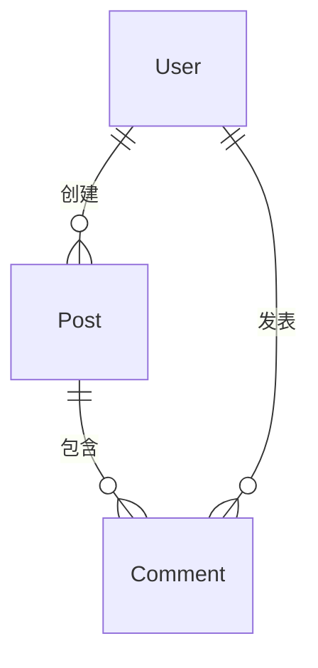

# CCG 智能仓库扫描

自动分析代码库，生成结构化的项目上下文报告，为后续的功能开发、代码审查、技术债务分析提供全面的背景信息。

---

## 核心能力

1. **技术栈识别**：自动检测框架、语言、工具链
2. **语义代码检索**：使用 ace-tool MCP 理解项目结构和核心模块
3. **生成上下文报告**：输出到 `.claude/repo-context.md`
4. **增量更新**：支持仅更新变更部分

---

## 执行流程

### 阶段 1：技术栈识别

使用 `Glob` 和 `Read` 工具检测项目配置文件：

#### 1.1 前端框架检测

检测文件：
- `package.json` - Node.js 项目
- `vite.config.ts/js` - Vite 项目
- `next.config.js/mjs` - Next.js 项目
- `nuxt.config.ts` - Nuxt 项目
- `angular.json` - Angular 项目
- `vue.config.js` - Vue CLI 项目

```bash
# 检测 package.json
Glob("package.json")

# 如果存在，读取并解析 dependencies
Read("package.json")

# 提取关键信息：
# - 框架：next, nuxt, vue, react, angular, svelte
# - 构建工具：vite, webpack, rollup, esbuild
# - 状态管理：redux, zustand, pinia, vuex
# - 样式方案：tailwindcss, sass, styled-components
```

#### 1.2 后端框架检测

检测文件：
- `go.mod` - Go 项目
- `Cargo.toml` - Rust 项目
- `requirements.txt` / `pyproject.toml` - Python 项目
- `composer.json` - PHP 项目
- `pom.xml` / `build.gradle` - Java 项目

```bash
# 示例：检测 Go 项目
if [ -f "go.mod" ]; then
  Read("go.mod")
  # 提取：module 名称、Go 版本、主要依赖（gin, echo, fiber）
fi
```

#### 1.3 数据库/ORM 检测

检测文件：
- `prisma/schema.prisma` - Prisma ORM
- `drizzle.config.ts` - Drizzle ORM
- `ormconfig.json` / `typeorm.config.ts` - TypeORM
- `migrations/` 目录 - 数据库迁移文件
- `database/` 目录 - 数据库相关代码

#### 1.4 测试框架检测

检测文件：
- `vitest.config.ts` - Vitest
- `jest.config.js` - Jest
- `playwright.config.ts` - Playwright
- `cypress.config.js` - Cypress
- `*_test.go` / `*_test.py` - Go/Python 测试

---

### 阶段 2：语义代码检索（ace-tool）

使用 `mcp__ace-tool__search_context` 进行深度分析：

#### 2.1 项目入口与启动流程

```bash
mcp__ace-tool__search_context {
  "project_root_path": "$PROJECT_DIR",
  "query": "项目的入口文件、main 函数、启动流程、应用初始化代码"
}
```

**期望结果**：
- 入口文件路径（如 `src/index.ts`, `main.go`, `app.py`）
- 启动流程概述（初始化顺序、中间件注册）

#### 2.2 API 路由与端点

```bash
mcp__ace-tool__search_context {
  "project_root_path": "$PROJECT_DIR",
  "query": "API 路由定义、HTTP 端点、RESTful 接口、GraphQL schema"
}
```

**期望结果**：
- 路由文件位置（如 `app/api/`, `routes/`, `controllers/`）
- 端点列表（GET /api/users, POST /api/auth/login）
- 认证中间件位置

#### 2.3 数据模型与数据库 Schema

```bash
mcp__ace-tool__search_context {
  "project_root_path": "$PROJECT_DIR",
  "query": "数据模型定义、数据库 schema、ORM 实体、表结构"
}
```

**期望结果**：
- Model 文件位置（如 `models/`, `prisma/schema.prisma`）
- 核心实体（User, Product, Order）
- 关系定义（一对多、多对多）

#### 2.4 前端组件结构

```bash
mcp__ace-tool__search_context {
  "project_root_path": "$PROJECT_DIR",
  "query": "前端页面组件、可复用组件、路由配置、页面布局"
}
```

**期望结果**：
- 组件目录结构（`components/`, `pages/`, `app/`）
- 路由配置文件（App Router 或 Pages Router）
- 全局布局组件

#### 2.5 测试覆盖情况

```bash
mcp__ace-tool__search_context {
  "project_root_path": "$PROJECT_DIR",
  "query": "单元测试、集成测试、E2E 测试文件"
}
```

**期望结果**：
- 测试目录结构（`__tests__/`, `tests/`, `*_test.go`）
- 测试覆盖率配置
- 主要测试用例

#### 2.6 核心业务逻辑

```bash
mcp__ace-tool__search_context {
  "project_root_path": "$PROJECT_DIR",
  "query": "核心业务逻辑、服务层、工具函数、辅助模块"
}
```

**期望结果**：
- 服务层位置（`services/`, `lib/`, `utils/`）
- 核心业务流程（支付、订单、认证）

---

### 阶段 3：生成上下文报告

将分析结果写入 `.claude/repo-context.md`：

#### 3.1 报告模板

```markdown
# 项目上下文报告

**生成时间**：{{YYYY-MM-DD HH:MM:SS}}
**项目路径**：{{PROJECT_DIR}}
**扫描范围**：全仓

---

## 1. 技术栈

### 1.1 核心框架

| 类型 | 技术 | 版本 |
|------|------|------|
| 前端框架 | {{框架名}} | {{版本号}} |
| 构建工具 | {{工具名}} | {{版本号}} |
| 状态管理 | {{方案名}} | {{版本号}} |
| 样式方案 | {{方案名}} | {{版本号}} |
| 后端框架 | {{框架名}} | {{版本号}} |
| 数据库 | {{数据库名}} | {{版本号}} |
| ORM | {{ORM名}} | {{版本号}} |
| 测试框架 | {{框架名}} | {{版本号}} |

### 1.2 主要依赖

**前端核心依赖**：
- {{依赖1}}@{{版本}}
- {{依赖2}}@{{版本}}

**后端核心依赖**：
- {{依赖1}}@{{版本}}
- {{依赖2}}@{{版本}}

---

## 2. 项目结构

### 2.1 目录树概览

```
{{PROJECT_NAME}}/
├── src/                  # 源代码
│   ├── app/             # Next.js App Router / 应用入口
│   ├── components/      # 可复用组件
│   ├── lib/             # 工具库
│   ├── services/        # 服务层
│   └── types/           # TypeScript 类型定义
├── prisma/              # 数据库 schema
├── public/              # 静态资源
├── tests/               # 测试文件
├── .env.example         # 环境变量模板
├── package.json         # 依赖配置
└── tsconfig.json        # TypeScript 配置
```

### 2.2 关键文件/目录说明

| 路径 | 用途 | 备注 |
|------|------|------|
| {{路径1}} | {{用途说明}} | {{补充信息}} |
| {{路径2}} | {{用途说明}} | {{补充信息}} |

---

## 3. API 接口

### 3.1 路由定义文件

**位置**：{{路由文件路径}}

### 3.2 端点列表

| 方法 | 路径 | 描述 | 认证 |
|------|------|------|------|
| GET | /api/users | 获取用户列表 | 需要 |
| POST | /api/auth/login | 用户登录 | 不需要 |
| PUT | /api/posts/:id | 更新文章 | 需要 |
| DELETE | /api/posts/:id | 删除文章 | 需要 |

### 3.3 认证/授权

- **认证方式**：{{JWT / Session / OAuth}}
- **中间件位置**：{{middleware.ts 路径}}
- **权限控制**：{{RBAC / ABAC / 无}}

---

## 4. 数据模型

### 4.1 Schema 文件

**位置**：{{schema 文件路径}}

### 4.2 核心实体

#### User（用户）

```prisma
model User {
  id        String   @id @default(cuid())
  email     String   @unique
  name      String?
  posts     Post[]
  createdAt DateTime @default(now())
}
```

**关系**：
- User → Post (一对多)
- User → Comment (一对多)

#### Post（文章）

```prisma
model Post {
  id        String   @id @default(cuid())
  title     String
  content   String
  author    User     @relation(fields: [authorId], references: [id])
  authorId  String
  comments  Comment[]
  createdAt DateTime @default(now())
}
```

### 4.3 关系图



---

## 5. 前端结构

### 5.1 路由配置

**路由类型**：{{App Router / Pages Router / Vue Router / React Router}}

**路由文件**：{{路由配置文件路径}}

### 5.2 页面列表

| 路由 | 组件 | 描述 |
|------|------|------|
| / | HomePage | 首页 |
| /login | LoginPage | 登录页 |
| /dashboard | DashboardPage | 仪表盘 |
| /posts/[id] | PostDetailPage | 文章详情 |

### 5.3 核心组件

| 组件名 | 路径 | 用途 |
|--------|------|------|
| Header | components/Header.tsx | 全局头部 |
| Sidebar | components/Sidebar.tsx | 侧边栏导航 |
| PostCard | components/PostCard.tsx | 文章卡片 |

### 5.4 状态管理

- **方案**：{{Redux / Zustand / Pinia / Context API}}
- **Store 文件**：{{store 文件路径}}
- **核心状态**：
  - `user`: 当前用户信息
  - `posts`: 文章列表
  - `ui`: UI 状态（loading、modal）

---

## 6. 核心业务模块

### 6.1 认证模块

**位置**：{{auth 模块路径}}

**流程**：
1. 用户提交邮箱/密码
2. 验证凭证
3. 生成 JWT token
4. 设置 cookie / localStorage
5. 返回用户信息

**关键文件**：
- `app/api/auth/login/route.ts` - 登录接口
- `lib/auth.ts` - 认证工具函数
- `middleware.ts` - 认证中间件

### 6.2 {{其他业务模块}}

**位置**：{{模块路径}}

**流程**：{{业务流程描述}}

**关键文件**：
- {{文件1}}
- {{文件2}}

---

## 7. 测试覆盖

### 7.1 测试框架

**单元测试**：{{Vitest / Jest / Go test}}
**集成测试**：{{Supertest / HTTP 测试}}
**E2E 测试**：{{Playwright / Cypress}}

### 7.2 测试文件分布

| 目录 | 测试类型 | 文件数 |
|------|----------|--------|
| `__tests__/unit/` | 单元测试 | {{数量}} |
| `__tests__/integration/` | 集成测试 | {{数量}} |
| `e2e/` | E2E 测试 | {{数量}} |

### 7.3 覆盖率

**当前覆盖率**：{{如果有配置文件则显示}}

**测试运行命令**：
```bash
npm run test        # 单元测试
npm run test:e2e    # E2E 测试
npm run test:coverage # 覆盖率报告
```

---

## 8. 开发工作流

### 8.1 启动命令

```bash
# 开发模式
npm run dev

# 构建
npm run build

# 生产环境启动
npm start

# 数据库迁移
npx prisma migrate dev
```

### 8.2 环境变量

**配置文件**：`.env.local`（参考 `.env.example`）

**必需变量**：
- `DATABASE_URL` - 数据库连接字符串
- `NEXTAUTH_SECRET` - 认证密钥
- `API_URL` - API 基础地址

---

## 9. CI/CD 与部署

### 9.1 CI 配置

**文件**：{{.github/workflows/ci.yml 或其他}}

**流程**：
1. Lint 检查
2. 类型检查
3. 单元测试
4. 构建验证

### 9.2 部署平台

**平台**：{{Vercel / Netlify / Docker / 自建}}

**部署分支**：{{main / production}}

---

## 10. 技术债务与改进建议

### 10.1 待优化项

- {{发现的技术债务1}}
- {{发现的技术债务2}}

### 10.2 建议

- {{改进建议1}}
- {{改进建议2}}

---

## 附录：扫描元数据

- **扫描工具**：CCG Multi-Model Collaboration System
- **扫描时长**：{{扫描耗时}}
- **分析文件数**：{{文件总数}}
- **代码行数**：{{总行数}}（可选）
```

#### 3.2 写入报告

```bash
# 确保目录存在
mkdir -p .claude

# 写入报告
Write(".claude/repo-context.md", {{生成的内容}})

# 提示用户
echo "✅ 项目上下文报告已生成：.claude/repo-context.md"
```

---

## 使用示例

### 示例 1：首次扫描

```bash
# 用户执行命令
/ccg:scan

# 输出：
🔍 开始扫描项目...

[1/3] 识别技术栈...
  ✓ 检测到 Next.js 14
  ✓ 检测到 Prisma ORM
  ✓ 检测到 Tailwind CSS

[2/3] 语义代码检索...
  ✓ 分析入口文件 (src/app/layout.tsx)
  ✓ 分析 API 路由 (12 个端点)
  ✓ 分析数据模型 (5 个实体)
  ✓ 分析前端组件 (23 个组件)
  ✓ 分析测试覆盖 (45 个测试用例)

[3/3] 生成报告...
  ✓ 报告已写入：.claude/repo-context.md

✅ 扫描完成！共分析 156 个文件，耗时 12 秒。
```

### 示例 2：增量更新

```bash
# 用户执行命令（带参数）
/ccg:scan --update

# 检测到现有报告，仅更新变更部分
🔍 检测到现有报告，执行增量更新...

  ✓ 更新技术栈信息
  ✓ 重新分析 API 路由（新增 2 个端点）
  ✓ 报告已更新

✅ 增量更新完成！
```

---

## 注意事项

1. **大型项目优化**：对于超过 1000 个文件的项目，考虑分批调用 ace-tool 或使用缓存
2. **敏感信息过滤**：不要在报告中包含 API 密钥、密码、token
3. **报告位置**：`.claude/` 目录应加入 `.gitignore`
4. **更新频率**：建议在重大架构变更后重新扫描

---

## 输出格式

命令执行完成后，确保：

- [x] `.claude/repo-context.md` 文件已生成
- [x] 报告包含所有必需章节
- [x] Mermaid 图表语法正确
- [x] 表格格式规范
- [x] 文件路径使用相对路径

---

现在开始执行扫描！
